# 量子模拟器网页使用说明   Manual of QSimulatorWeb

> 适用于软件版本1.0.0，编辑于20220627 姚睿。

QSimulatorWeb 是一个可拖动量子线路的前端项目。它提供图形化界面用拖动的方式来编辑量子线路，向后端 QuantumSimulationPlatform(qsp) 服务器提交量子线路模拟任务并下载模拟结果，能够实现数据可视化。

## 目录

- [量子模拟器网页使用说明   Manual of QSimulatorWeb](#量子模拟器网页使用说明--manual-of-qsimulatorweb)
  - [目录](#目录)
  - [1. 用户界面](#1-用户界面)
    - [1.1 量子门调色盘](#11-量子门调色盘)
    - [1.2 量子线路](#12-量子线路)
    - [1.3 控制面板](#13-控制面板)
    - [1.4 数据可视化面板](#14-数据可视化面板)
    - [1.5 服务器状态](#15-服务器状态)
  - [2. 使用说明](#2-使用说明)
    - [2.1 新建线路](#21-新建线路)
      - [2.1.1 拖动新建线路](#211-拖动新建线路)
      - [2.1.2 插入量子门](#212-插入量子门)
      - [2.1.3 设置量子门参数](#213-设置量子门参数)
      - [2.1.4 Control Gate 操作](#214-control-gate-操作)
      - [2.1.5 Swap Gate 操作](#215-swap-gate-操作)
    - [2.2 运行线路](#22-运行线路)
      - [2.2.1 单次采样](#221-单次采样)
      - [2.2.2 多次采样](#222-多次采样)
    - [2.3 显示结果](#23-显示结果)
      - [2.3.1 单次采样的结果](#231-单次采样的结果)
      - [2.3.2 多次采样的结果](#232-多次采样的结果)
    - [2.4 线路保存](#24-线路保存)
    - [2.4.1 存储读取线路](#241-存储读取线路)
    - [2.4.2 下载上传线路](#242-下载上传线路)
  - [3. 规范定义](#3-规范定义)
    - [3.1 非法量子门](#31-非法量子门)
      - [3.1.1 可设置参数量子门](#311-可设置参数量子门)
      - [3.1.2 成对的 Swap Gates](#312-成对的-swap-gates)
      - [3.1.3 串联的 Control Gates](#313-串联的-control-gates)
    - [3.2 线路编码](#32-线路编码)

## 1. 用户界面

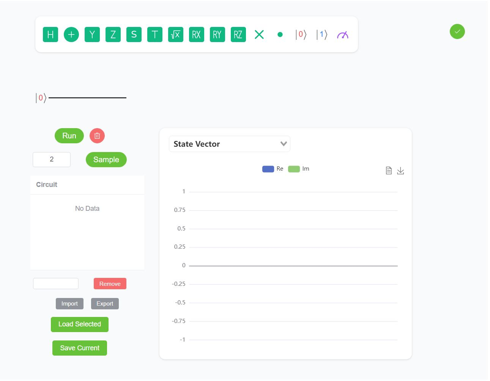

### 1.1 量子门调色盘

从调色盘中拖动量子门到量子线路中，用户可以实现量子门的新增。

将鼠标放在量子门上，会显示对应量子门的名称和介绍。

### 1.2 量子线路

用户需要将量子门放置于量子线路中。

蓝色可移动线条代表步骤选择器。

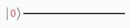

### 1.3 控制面板

用户可以在这里控制线路运行，设置采样次数，存储读取线路。

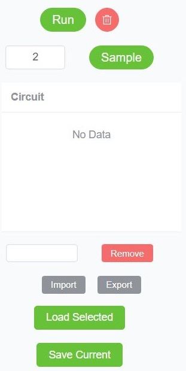

### 1.4 数据可视化面板

展示线路运行结果。

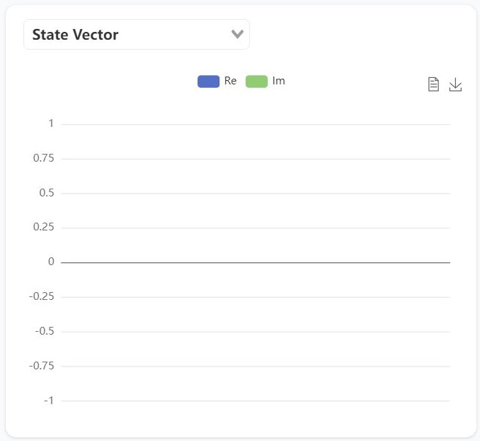

### 1.5 服务器状态

显示服务器连接状态。

## 2. 使用说明

### 2.1 新建线路

#### 2.1.1 拖动新建线路

将鼠标放在调色盘的量子门上，会显示对应量子门的名称和介绍。从调色盘中拖动量子门到量子线路中，用户可以实现量子门的新增。已经放置的量子门可以再次被拖动到其它位置。将量子门拖动到量子线路外可以实现量子门删除操作。

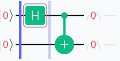

#### 2.1.2 插入量子门

将量子门拖动到横向相邻的两个量子门的中间位置可以实现量子门的插入。

#### 2.1.3 设置量子门参数

对于量子线路中可以设置参数的量子门，用户可以点击弹出参数设置对话框。右侧删除按钮表示删除量子门操作。

参数设置的单位为 π ，中间的输入框可以输入数值或表达式，合法的数值是浮点数，合法的表达式是浮点数和四则运算符号。例如可以输入 0.333 或 1/3 ，运算结果为 0.333π 或 1/3π 。

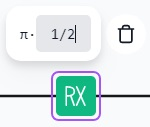

#### 2.1.4 Control Gate 操作

每一步的所有 Control Gates 会串联作用到这一步的所有其它的量子门上，不包括 Reset Operation 和 Measurement Gate 。

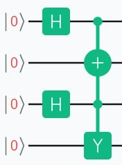

#### 2.1.5 Swap Gate 操作

Swap Gate 只能成对添加或者删除，点击其中一个 Swap Gate 会高亮显示与之配对的 Swap Gate，当一对 Swap Gates 位于同一步时，并且不和其它成对的 Swap Gates 相交时，程序会将这对 Swap Gates 连接以表示有效。

### 2.2 运行线路

#### 2.2.1 单次采样

点击控制面板中的 Run 按钮可以实现线路的单次采样，采样结果会显示在数据可视化面板中，如果线路中存在 Measurement Gate ，测量结果也会同步显示在它上面。

单次采样的结果包含每一步的 State Vector 和 Probability 数据，不包含 Sampling Distribution 数据。

清空按钮可以实现线路的清空操作。

如果线路中包含非法量子门将会显示警告，并将非法量子门高亮显示，直到用户修改完毕。

#### 2.2.2 多次采样

在控制面板的采样数输入框中输入正整数，范围为 2 ~ 1000 ，并点击 Sample 按钮，可以实现线路的多次采样，采样结果会显示在数据可视化面板中。

多次采样的结果包含 Sampling Distribution 数据，不包含每一步的 State Vector 和 Probability 数据。

如果线路中包含非法量子门将会显示警告，并将非法量子门高亮显示，直到用户修改完毕。

### 2.3 显示结果

#### 2.3.1 单次采样的结果

在单次采样命令成功运行后，数据可视化面板可以选择显示 State Vector 和 Probability 图表。

通过点击移动线路中的 **步骤选择器（蓝色线条）**，可以在图表中显示对应步骤的结果。

State Vector 图表显示的是态矢量，蓝色代表实部，绿色代表虚部。

Probability 图表显示的是态矢量各分量的概率。

点击图表右上角的两个按钮，可以显示表格数据和下载数据。

例如线路：

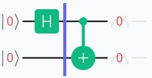

单次采样结果为：

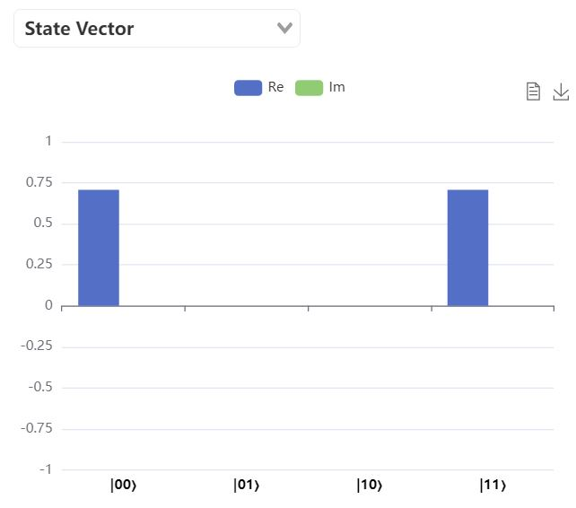

#### 2.3.2 多次采样的结果

在多次采样命令成功运行后，数据可视化面板可以选择显示 Sampling Distribution 图表。

Sampling Distribution 图表显示的是多次采样结果的分布。

对于 [2.3.1](#231-单次采样的结果) 中的样例线路，1000 次采样的结果为：

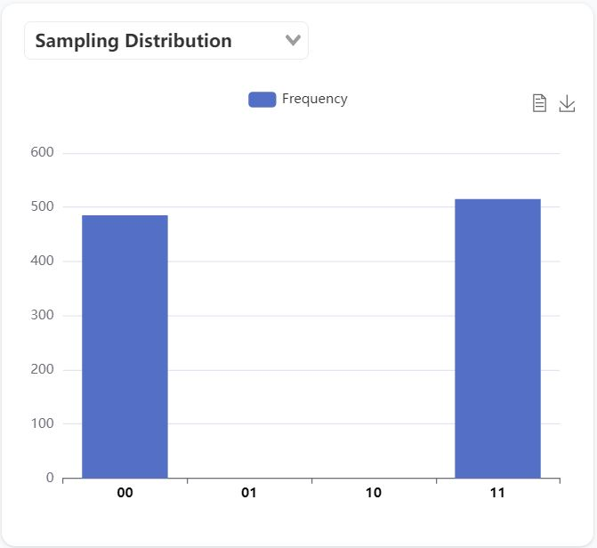

### 2.4 线路保存

### 2.4.1 存储读取线路

点击 Save Current 按钮，用户可以将当前线路存储到上方列表中。

选中列表中的线路后，用户可以在下方输入框中编辑对应线路的名称。

点击 Remove 按钮，用户可以删除列表中选中的线路。

点击 Load Select 按钮，用户可以将选中的线路加载到当前线路。

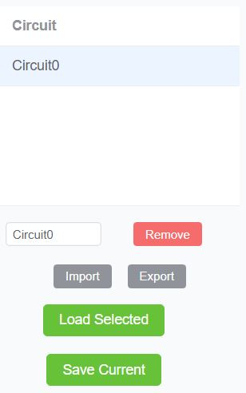

### 2.4.2 下载上传线路

点击 Export 按钮，用户可以将列表中选中的线路以文件形式下载到本地，线路编码符合量子计算服务器规范。

点击 Import 按钮，用户可以将本地的线路文件上传到列表中。

## 3. 规范定义

### 3.1 非法量子门

#### 3.1.1 可设置参数量子门

对于可设置参数量子门，合法的参数为数值或表达式，合法的数值是浮点数，合法的表达式是浮点数和四则运算符号。

#### 3.1.2 成对的 Swap Gates

成对的 Swap Gates 必须位于同一步中。任意两对 Swap Gates 不能相交。

#### 3.1.3 串联的 Control Gates

如果当前步中没有合法的受控量子门，则当前步中的 Control Gates 是非法的。

如果 Control Gates 的连线穿过了 Reset Operation 或 Measurement Gate ，则这个 Reset Operation 或 Measurement Gate 是非法的。

### 3.2 线路编码

线路编码符合量子计算服务器规范。
