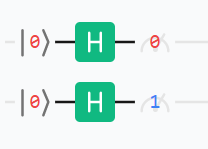

# 态编码方案

态编码方案定义了 QuantumSimulationPlatform(qsp) 服务器计算出的数据的编码方式，涉及到量子态、时刻(Moment)、测量结果、采样次数。

## 传输参数

| 字段名       | 二级字段        | 三级字段    | 类型        | 说明                           |
| ------------ | --------------- | ----------- | ----------- | ------------------------------ |
| verification |                 |             | object      | 验证信息，暂无方案置空         |
|              | circuitEncoding |             | string      | 量子线路编码                   |
|              | samples         |             | int         | 采样次数 N>=1                  |
|              | qubits          |             | int         | 量子比特数 n>=1                |
|              | moments         |             | int         | 时刻数 M>=1                    |
|              | data            |             | object      | data 传输项目                  |
|              |                 | stateVector | boolean     | 是否传输态矢量 true / false    |
|              |                 | measurement | boolean     | 传输测量结果 true              |
| qubits       |                 |             | array       | 量子比特命名，规定从 0 到 n-1  |
|              | name            |             | string      | qi, i: int                     |
| data         |                 |             | array       | 按采样数排序，从 0 到 N-1      |
|              | stateVector     |             | array       | 按时刻数排序，从 0 到 M-1      |
|              |                 | real        | float array | 按量子态排序，从 0 到 2^n-1    |
|              |                 | imaginary   | array       | 按量子态排序，从 0 到 2^n-1    |
|              | measurement     |             | array       | 无序，长度为线路中测量门的数量 |
|              |                 | moment      | int         | 时刻序号，in [0, M-1]          |
|              |                 | qubit       | object      | 量子比特序号，in [0, M-1]      |
|              |                 | value       | int         | 测量结果 1 / 0                 |

## Json 模板

```
{
  "verification": {
    "circuitEncoding": "string",
    "samples": "N: int",
    "qubits": "n: int",
    "moments": "M: int",
    "data": {
      "stateVector": "boolean",
      "measurement": true
    }
  },
  "qubits": [{ "name": "qi, i: int" }, {}],
  "data": [
    {
      "stateVector": [
        {
          "real": ["float * 2^n"],
          "imaginary": ["float * 2^n"]
        },
        {}
      ],
      "measurement": [
        {
          "moment": "int",
          "qubit": { "name": "qi, i: int" },
          "value": "1/0: int"
        },
        {}
      ]
    },
    {}
  ]
}
```

## Json 示例

### 线路



### 示例 1，传输态矢量

```
{
  "verification": {
    "circuitEncoding": "",
    "samples": 1,
    "qubits": 2,
    "moments": 3,
    "data": {
      "stateVector": true,
      "measurement": true
    }
  },
  "qubits": [{ "name": "q0" }, { "name": "q1" }],
  "data": [
    {
      "stateVector": [
        {
          "real": [1, 0, 0, 0],
          "imaginary": [0, 0, 0, 0]
        },
        {
          "real": [0.5, 0.5, 0.5, 0.5],
          "imaginary": [0, 0, 0, 0]
        },
        {
          "real": [0, 1, 0, 0],
          "imaginary": [0, 0, 0, 0]
        }
      ],
      "measurement": [
        {
          "moment": 2,
          "qubit": { "name": "q0" },
          "value": 0
        },
        {
          "moment": 2,
          "qubit": { "name": "q1" },
          "value": 1
        }
      ]
    }
  ]
}
```

### 示例 2，不传输态矢量

```
{
  "verification": {
    "circuitEncoding": "",
    "samples": 1,
    "qubits": 2,
    "moments": 3,
    "data": {
      "stateVector": false,
      "measurement": true
    }
  },
  "qubits": [{ "name": "q0" }, { "name": "q1" }],
  "data": [
    {
      "stateVector": [],
      "measurement": [
        {
          "moment": 2,
          "qubit": { "name": "q0" },
          "value": 0
        },
        {
          "moment": 2,
          "qubit": { "name": "q1" },
          "value": 1
        }
      ]
    }
  ]
}
```
